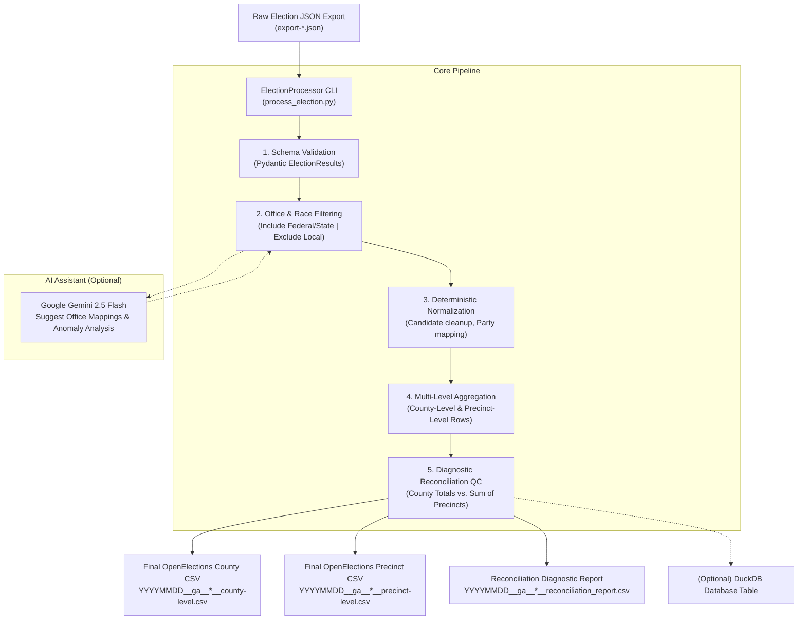

# OpenElections Georgia — Enhanced Voting Results Processor

A unified, high-performance CLI pipeline for standardizing Georgia election results directly from raw Secretary of State / Enhanced Voting JSON exports into canonical OpenElections CSVs (`county-level.csv`, `precinct-level.csv`), complete with automated Federal/State race filtering, non-blocking reconciliation QC, and Google Gemini AI assistance.

---

## Table of Contents
1. [Overview & Architecture](#overview--architecture)
2. [How Office Filtering Works (Federal/State vs. Local)](#how-office-filtering-works)
3. [Reconciliation & Quality Control](#reconciliation--quality-control)
4. [Google Gemini AI Assistant](#google-gemini-ai-assistant)
5. [CLI Reference & Options](#cli-reference--options)
6. [Step-by-Step Usage Guide](#step-by-step-usage-guide)
7. [Directory & File Layout](#directory--file-layout)

---

## 1. Overview & Architecture

Previously, standardizing election results required multiple disconnected steps:
1. Running a Jupyter notebook (`load_json.ipynb`) with an interactive file chooser.
2. Generating intermediate flattened JSON files on disk.
3. Loading intermediate JSONs into DuckDB and manually executing multi-step SQL scripts (`jun2025_psc_special_election_county.sql`).
4. Manually updating SQL strings for office/party cleanup and running `COPY` commands.

### The Streamlined Pipeline
The new processor replaces the entire multi-stage process with a single deterministic pipeline:



---

## 2. How Office Filtering Works

OpenElections tracks **Federal and State offices** in Georgia. In major elections, state JSON exports often bundle municipal, county, and local ballot items (e.g. `Tax Commissioner`, `Mayor`, `Sheriff`, `Board of Education`, `SPLOST` referendums) that must be excluded.

### The Filtering Logic:
1. **Canonical Federal & State Offices (Included)**:
   The master configuration [`cleaning_rules.yaml`](cleaning_rules.yaml) maintains the 19 standard OpenElections Georgia offices:
   - **Federal**: `President`, `Vice President`, `U.S. Senate`, `U.S. House`
   - **State Executive**: `Governor`, `Lieutenant Governor`, `Secretary of State`, `Attorney General`, `State School Superintendent`, `Commissioner of Agriculture`, `Commissioner of Insurance`, `Commissioner of Labor`, `Public Service Commissioner`
   - **State Legislative**: `State Senate`, `State House`
   - **State Judicial**: `Supreme Court Justice`, `Appeals Court Judge`, `Superior Court Judge`, `District Attorney`

2. **Known Local / Municipal Patterns (Excluded by Default)**:
   Any race matching local patterns (e.g. `Tax Commissioner`, `Sheriff`, `Coroner`, `County Commissioner`, `Mayor`, `City Council`, `Board of Education`, `SPLOST`, `Referendum`, `Probate Court`, etc.) is automatically categorized as `[EXCLUDED - LOCAL]` and dropped from the output CSVs.

3. **Unrecognized Races (Flagged)**:
   Any office string that is neither in the canonical Federal/State list nor in the known local exclusion list is flagged as `[UNMAPPED]`. If `--ai` is enabled, Google Gemini is prompted to classify it.

4. **Optional Inclusion**:
   If you ever want to process all races (including local ones), pass the `--all-offices` flag.

---

## 3. Reconciliation & Quality Control

In real-world voting data (especially in Georgia SOS / Enhanced Voting exports), **precinct totals rarely sum up to 100% of county totals**:
- Small precincts are often withheld or suppressed for voter privacy.
- Certain ballot categories (such as countywide provisional ballots, challenged ballots, or overseas ballots) are tabulated at the county level but never allocated to individual precincts.

### How QC is Handled:
Instead of a rigid assertion that fails the build, [`reconciler.py`](reconciler.py) evaluates each contest:
- $\text{Diff} = \text{County Total} - \sum(\text{Precincts})$
- Contests with small variances ($\le 15$ votes or $\ge 90\%$ coverage) are categorized as `[EXPECTED_RESIDUAL]`.
- Non-standard discrepancies are flagged as `[DISCREPANCY]`.
- The CLI prints a diagnostic summary table and outputs a companion `*_reconciliation_report.csv` file for complete auditability.

---

## 4. Google Gemini AI Assistant

The AI assistant ([`ai_assistant.py`](ai_assistant.py)) is powered by Google Gemini (`gemini-2.5-flash`):
- **Automated Office & District Resolution**: If an election export has weird or newly structured office strings (e.g. `"PSC - District 3/ Para servicio público Comisión - Distrito 3 - Dem"`), Gemini parses the canonical office name, district number, and party affiliation.
- **Rule Learning (`--save-ai-rules`)**: When enabled, Gemini's approved mappings are automatically saved into `cleaning_rules.yaml` for permanent deterministic reuse.
- **Anomaly Assessment**: When significant discrepancies occur, Gemini provides a plain-text assessment of likely causes (such as unassigned early voting batches).
- **Zero API Key Penalty**: If no `GEMINI_API_KEY` is provided, the tool falls back seamlessly to rule heuristics.

---

## 5. CLI Reference & Options

Run the CLI using `uv run python enhanced_voting_process/process_election.py [OPTIONS]`:

```text
usage: process_election.py [-h] -i INPUT [-o OUTDIR] [--inspect] [--ai]
                           [--save-ai-rules] [--all-offices]
                           [--duckdb DUCKDB] [--rules RULES]
                           [--api-key API_KEY]

OpenElections Georgia Voter Results Processor

options:
  -h, --help            show this help message and exit
  -i INPUT, --input INPUT
                        (Required) Path to raw JSON election export file
  -o OUTDIR, --outdir OUTDIR
                        Output directory for generated CSV files (defaults to input dir)
  --inspect             Inspect / dry-run mode (prints summary & QC without writing CSVs)
  --ai                  Enable Gemini AI assistant for unmapped offices & anomaly analysis
  --save-ai-rules       Auto-save AI approved mappings into cleaning_rules.yaml
  --all-offices         Process all offices (including non-standard local/municipal races)
  --duckdb DUCKDB       Optional path to DuckDB file to load cleaned tables into
  --rules RULES         Custom path to cleaning_rules.yaml file
  --api-key API_KEY     Google Gemini API Key (or set GEMINI_API_KEY env var)
```

---

## 6. Step-by-Step Usage Guide

### Step 1: Configure Gemini API Key (Optional)
```bash
cp enhanced_voting_process/.env.example enhanced_voting_process/.env
```
Edit `enhanced_voting_process/.env`:
```env
GEMINI_API_KEY="AIzaSy..."
```

### Step 2: Inspect a New File (Dry Run)
Verify the detected races, excluded local contests, and candidate totals:
```bash
uv run python enhanced_voting_process/process_election.py \
  --input ~/Development/openelections-sources-ga/2025/export-2025PSCPrimaryRunoff.json \
  --inspect
```

### Step 3: Run with AI Assistance
If new office formats exist and you want Gemini to suggest and save mappings:
```bash
uv run python enhanced_voting_process/process_election.py \
  --input ~/Development/openelections-sources-ga/2025/export-2025PSCPrimaryRunoff.json \
  --ai \
  --save-ai-rules
```

### Step 4: Generate Final OpenElections CSVs
Produce standard county-level and precinct-level CSVs:
```bash
uv run python enhanced_voting_process/process_election.py \
  --input ~/Development/openelections-sources-ga/2025/export-2025PSCPrimaryRunoff.json \
  --outdir ./2025/
```

### Step 5: (Optional) Load into DuckDB
Directly insert clean tables into your DuckDB database:
```bash
uv run python enhanced_voting_process/process_election.py \
  --input ~/Development/openelections-sources-ga/2025/export-2025PSCPrimaryRunoff.json \
  --outdir ./2025/ \
  --duckdb 2025/code/openelections_2025.duckdb
```

---

## 7. Directory & File Layout

```text
enhanced_voting_process/
├── process_election.py     # Main CLI entrypoint
├── cleaner.py              # String normalization & regex engine
├── reconciler.py           # County vs. Precinct diagnostic reconciliation logic
├── ai_assistant.py         # Google Gemini integration & anomaly reporter
├── cleaning_rules.yaml     # Pre-seeded master rules & exclusion patterns
├── enhanced_json_model.py  # Pydantic schema validator
├── .env.example            # API key environment template
└── README.md               # Pipeline documentation
```
